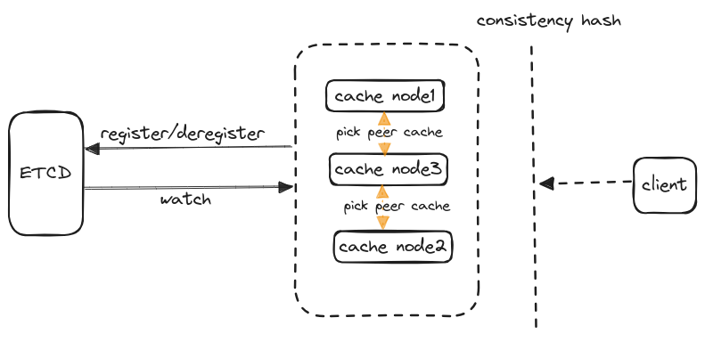

# cb-cache

## introduce

分布式的kv内存数据库

- 缓存获取流程：
  
    - 优先从本地cache获取kv
    - 如果没获取到，会经由一致性哈希算法找到最近的对等节点,然后获取远端节点的kv并缓存以减少网络请求
    - 如果还没找到，可以通过`getter`设置k的数据源获取，用以缓存同步
- 整体架构
  
## implementation

- 多节点备份与缓存预热
- LRU-K策略
- 一致性哈希
- singlefilght与并发读写
  
## thinking

### 缓存击穿

针对可能发生的缓存击穿问题，只允许同时只有一个协程获取某个key

### lru-k设计

lru-k没啥好说的，主要是在lru的基础上，变更为`history lru data`和`real lru cache`:

- 数据第一次加入缓存，先加入`history lru data`中作为历史数据，只有等访问次数达到`k`时，才会删除并移到`real lru cache`
- 访问次数达到`k`次的数据以后会被移到真正的缓存里

> lru-k可以很好的解决lru算法的缺陷——lru不能很好地识别到热点数据

### 服务发现与注册

原始groupcache的设计里，节点的离线与上线是无法感知的。于是，便基于etcd实现了服务发现与注册。
当然consul, zookeeper等组件调用方可以自己实现下面的接口无缝衔接

```go
type Client interface {
	Registry
	Discovery
}

type Registry interface {
	Register(ctx context.Context, addr string) error
	Deregister(ctx context.Context, addr string) error
}

type Discovery interface {
	GetAddress(ctx context.Context) ([]string, error)
	Watch(ctx context.Context) <-chan Event
}

```