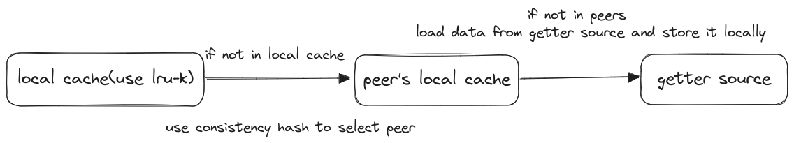

# cb-cache

## introduce

分布式的kv内存数据库

- 缓存获取流程：
  
    - 优先从本地cache获取kv
    - 如果没获取到，会经由一致性哈希算法找到最近的对等节点,然后获取远端节点的kv
    - 如果还没找到，可以通过`getter`设置k的数据源获取，用以缓存同步

## implementation

- `lru-k`缓存淘汰
- 多节点的一致性哈希
- 防止缓存击穿
- 支持并发读写
- 具备一定弱一致性

## thinking

### 缓存击穿

针对可能发生的缓存击穿问题，只允许同时只有一个协程获取某个key

### lru-k设计

lru-k没啥好说的，主要是在lru的基础上，变更为`history lru data`和`real lru cache`:

- 数据第一次加入缓存，先加入`history lru data`中作为历史数据，只有等访问次数达到`k`时，才会删除并移到`real lru cache`
- 访问次数达到`k`次的数据以后会被移到真正的缓存里

> lru-k可以很好的解决lru算法的缺陷——lru不能很好地识别到热点数据

### 缓存一致性设计

getter里提供稳定的大量的需要高频访问的数据，然后有两级缓存体系（本地缓存+分布式节点缓存）；
所以，这个kv数据库比较适合**大量**热点数据的读多写少场景（写多读少会造成缓存大量的不一致性）

假设：如果从getter里获取的数据发生了更新，但是已经获取的数据，
依然还是旧版本数据，会导致数据不一致性，如何解决？

如果某个key的数据更新，需要主动将缓存里的数据淘汰掉，保证较高的一致性。
在getter里新增回调函数，如果key更新，需要删除缓存里的key,来保证一致性。
这样可以解决一定的写操作带来的数据不一致性问题；但是不适合写多读少，因为在此场景下，
缓存命中率会急剧下降,而且频繁的删除会导致频繁抢锁，导致缓存读取延后

getter或许是从redis,mysql等组件读热点数据。
如何监控key发生变化呢?  
~~查询再比较新旧值？~~ or 在外部提供一个api，如果更新key时，就需要通知删除缓存 

实现一个发布订阅模型：可以有一个发布者往queue输送需要删除哪个key,
然后再由订阅者延迟接收key并删除之
  